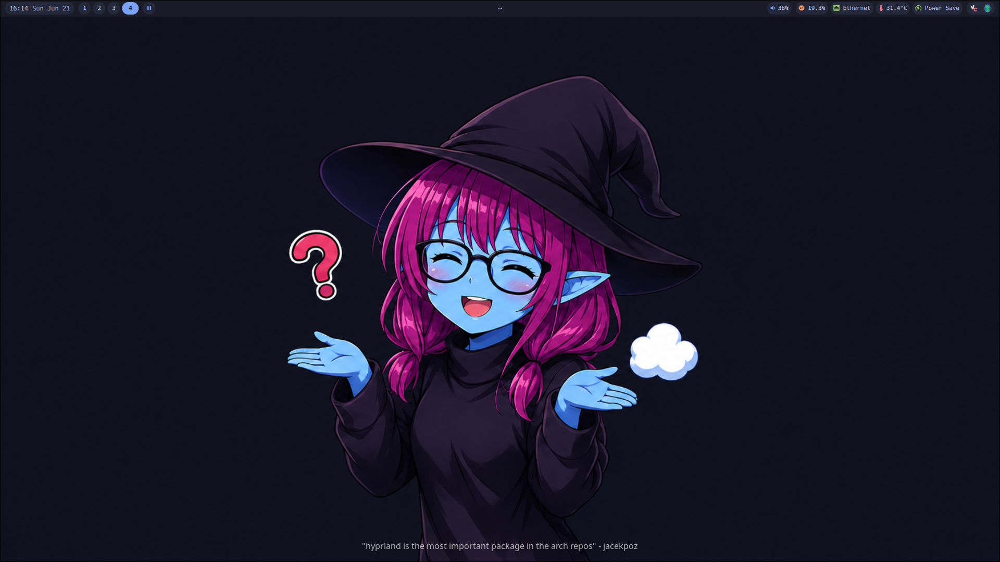

# arf-linux

Arch Linux automated installer ISO with Hyprland, Quickshell Tokyo Night bar, and one-shot post-install configuration.

## Features

- **Automated install** — interactive archinstall-based stage1 with disk selection, user setup, timezone
- **Tokyo Night theme** — dark theme across bar, kitty, fastfetch, fren, btop, zed, hyprlock, SDDM
- **Quickshell bar** — with app launcher (SUPER+R), theme switcher (SUPER+T), monitor manager (SUPER+D), power profile indicator
- **Hyprland** with Lua config (hyprland.lua) + minimal legacy parser for keyboard input (hyprland.conf)
- **BTRFS** filesystem with zstd compression
- **WiFi config** — prompted during install, persisted to installed system
- **Stage2 auto-config** — dotfiles, AUR packages, flatpaks, wallpapers run on first boot via systemd oneshot

## Repository Structure

```
arf-linux/               # Installer scripts, dotfiles, patches
  install.sh             # Stage2 post-install script (copied to installed system)
  packages.txt           # Official + AUR package list
  dotfiles/              # Default configs for hypr, kitty, btop, fastfetch, zsh, etc.
    quickshell-patch/    # Applied after cloning quickshell-config from GitHub
arf-linux-iso/           # ISO build profile
  build.sh               # Builds the bootable ISO with archiso
  profiledir/            # archiso config, airootfs overlay, arf-installer
    airootfs/opt/arf-linux/     # Bundled copy of arf-linux/ (copied at build time)
    airootfs/usr/local/bin/arf-installer  # Stage1 installer (auto-launched on boot)
```

## Build the ISO

```sh
cd arf-linux-iso
sudo ./build.sh
```

Requires `archiso` on an Arch Linux system. Output: `out/arf-linux-<date>-x86_64.iso`.

## Install

1. Write ISO to USB: `sudo dd if=arf-linux-<date>-x86_64.iso of=/dev/sdX bs=4M status=progress && sync`
2. Boot from USB — `arf-installer` auto-launches
3. Follow prompts: disk → WiFi (optional) → hostname/user/password/timezone → confirm wipe
4. Reboot → stage2 auto-runs (systemd oneshot) → final reboot → SDDM → Hyprland + Quickshell bar
   - Optionally run stage2 in chroot before first reboot to save one reboot

## Screenshots



## Keybinds

| Key | Action |
|---|---|
| SUPER + Q | Terminal (kitty) |
| SUPER + E | File manager (fren) |
| SUPER + R | App launcher (Quickshell) |
| SUPER + T | Theme switcher (Quickshell) |
| SUPER + D | Monitor manager (Quickshell) |
| SUPER + C | Close window |
| SUPER + M | Exit Hyprland |
| SUPER + V | Toggle window float |
| SUPER + P | Pseudo-tile layout |
| SUPER + J | Toggle split layout |
| SUPER + F | Fullscreen window |
| SUPER + Z | Region screenshot (clipboard) |
| SUPER + arrows | Move focus directionally |
| SUPER + 1-0 | Switch workspace |
| SUPER + SHIFT + 1-0 | Move window to workspace |
| SUPER + S | Toggle scratchpad |
| SUPER + SHIFT + S | Move window to scratchpad |
| SUPER + mouse drag | Move window |
| SUPER + right-click drag | Resize window |
| SUPER + scroll | Scroll workspaces |
| XF86Audio (vol/bright) | Media & hardware keys |

## Post-Install

Stage2 installs:
- **AUR packages:** helium-browser-bin, animu-bin, fren-git
- **Flatpaks:** Vesktop, Heroic Game Launcher
- **Dotfiles:** hyprland, kitty, btop, fastfetch, fren, zed, zsh, rmpc
- **Wallpapers:** cloned from [TheCrabevariable/Wallpaper](https://github.com/TheCrabevariable/Wallpaper)
- **SDDM theme:** flower theme
- **Quickshell patches:** MonitorManager workaround for Hyprland Lua config
